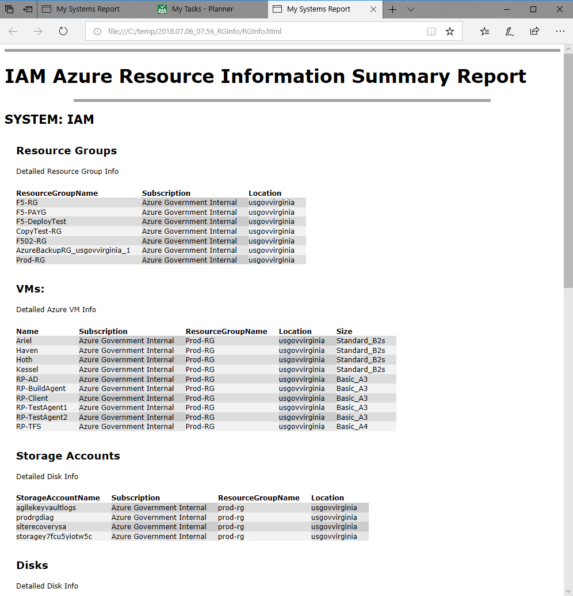

# GetRGInfo

**Get Resource Group Information** aka "GetRGInfo" allows a user to pick specific RGs in out-gridview and export basic info such as the following to CSV and html report:

- VM Details
- VNets
- Storage Accounts
- Disks
- etc...

This script is designed to be run in the ISE manually region by region.  It also spans Azure Subscriptions with ease.

If the run the CSV in the ISE it will automatically move you to the location of the script.

It is designed to be easily edited to for any specific purpose.  For example you can tailor it to only show a specific System's info in the output html and csv.

## Sample Screenshot

## Coming Soon

GetRGinfo is a framework that we can add to over time. In the near feature I'm hoping to much more detail particularly around VMs and Azure Backup.
